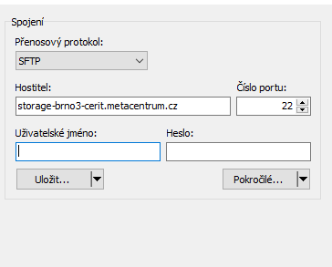
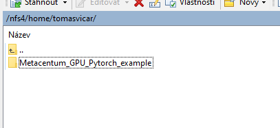
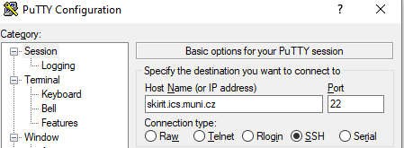
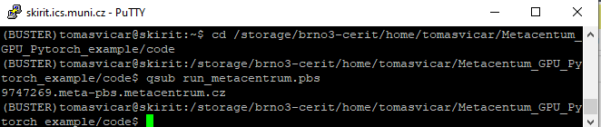
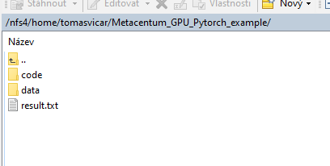
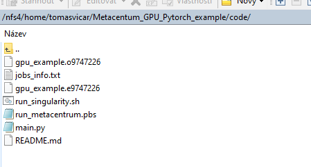

# nn-UNet metacentrum example

To run your Pytorch code with GPU on [Metacentrum](https://metavo.metacentrum.cz/) -  you can just add your Python code ang your data.

### How to run this example:

1. upload code and dat to storage (e.g. with WinSCP)
2. 



2. connet to front node using SSH (e.g. with PuTTY)




3. go to strage directory with code

```
cd /storage/brno3-cerit/home/username/Metacentum_GPU_Pytorch_example/code
```

4. run pbs script

```
qsub run_metacentrum.pbs
```



5. check for outputs - results an logs



